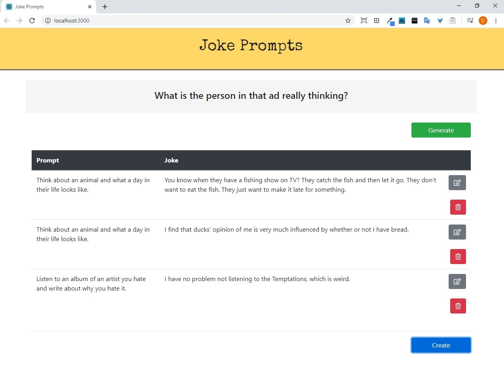
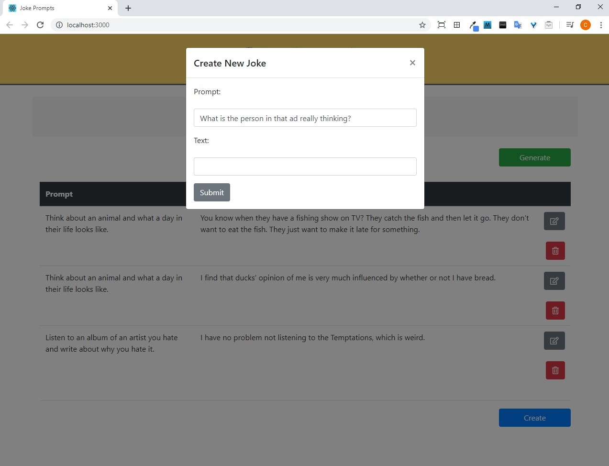

# Joke Prompts - web application (frontend)

## Table of Contents

* [General Info](#general-info)
* [Screenshot](#screenshot)
* [Technologies](#technologies)
* [Setup](#setup)
* [Features](#features)
* [Project Status](#project-status)
* [Inspiration](#inspiration)
* [Contact](#contact)

## General Info
This is the React frontend for the joke prompts site.

The repo for the backend can be found at: [https://github.com/cpadiernos/jokeprompts-be](https://github.com/cpadiernos/jokeprompts-be)

Taken together it is a web application that allows users to get a random prompt and to write, save, edit, and delete jokes.

## Screenshot



## Technologies
* JavaScript
* React 16.13.1
* reactstrap 8.4.1
* Jest
* React Testing Library

## Setup
To run the project on your local machine:

1. Clone the repository:
```
git clone https://github.com/cpadiernos/jokeprompst-fe.git
```

2. Go into jokeprompst-fe folder:
```
cd jokeprompst-fe
```

3. Start the project:
```
npm start
```

4. A broswer window will open. If not, navigate to http://localhost:3000, and you'll see the project.

Demo: Coming soon...

## Features
* Generate a random prompt
* Save, edit, delete jokes


To-dos:
* Create login to save your own jokes
* Add way to rate how your joke did when tested out in front of an audience
* ...

## Project Status
Integration tests are all passing. 100% coverage.

## Inspiration
I used to do stand up comedy and you need to be writing jokes daily. I made this app to help with creating jokes!

## Contact
Created by [@cpadiernos](https://www.linkedin.com/in/carolpadiernos/). Feel free to reach out!
